# X0X

X0X turns the M-VAVE FM-1 into a groovebox: a 909, an 808, two 303s and a breakbeat player,
all playing at once, in stereo. Each part can play its own pattern, you can arrange patterns
into a song, and you can record knob moves.

**X0X is in beta.** It's solid for everyday playing, but a very busy pattern can push the FM-1 to
its limit. When that happens, X0X gives up a little sound quality to keep playing rather than drop
out (see Performance in section 15).

---

## Contents

1. Install
2. Getting started
3. Controls
4. The screen
5. 909 and 808
6. 303A and 303B
7. TB-3PO
8. Break
9. Patterns
10. Recording
11. Knob motion
12. Song
13. Effects
14. Mix and master
15. Settings and saving
16. MIDI and USB audio
17. Troubleshooting
18. Parameters
19. Credits

---

## 1. Install

You can try X0X before installing it: **https://charlesvestal.github.io/fm1-x0x/emu/** runs the
same code in the browser, with sound, played with the mouse, a touch screen or the keyboard. You
can load your own breaks into it too, as you would upload them to the FM-1.

The easiest way to install X0X is the web installer at
**https://charlesvestal.github.io/fm1-x0x/install/**. It works in Chrome or Edge on a computer,
and you don't need to install anything else. Connect the FM-1 to the computer with a USB data
cable, open the page and press Install. Don't unplug the cable while it's writing. When it
finishes, the FM-1 restarts into X0X.

You can also install from the command line. Download the firmware file (for example
`x0x-0.10-beta.fwsc`) from the
[releases page](https://github.com/charlesvestal/fm1-x0x/releases), get the X0X source code from
GitHub, install Python 3 with the `mido` and `python-rtmidi` packages
(`pip3 install mido python-rtmidi`), and run:

```
python3 tools/fm1_install.py x0x-0.10-beta.fwsc
```

(The web installer on hugelton.github.io installs Felucca, not X0X.)

To go back to the original firmware, use "Back to the stock firmware" at the bottom of the
web installer: download M-VAVE's FM-1 V15 file from the link there, choose it, and press the
button. (M-VAVE's own updater, M-UPGRADE, works too.) If the FM-1 no longer starts, see
[Recovering an FM-1 that won't start](#recovering-an-fm-1-that-won-t-start). Installing
third-party firmware is at your own risk.

---

## 2. Getting started

Here's a five-minute tour, from switching on to saving your first beat. When X0X starts,
the screen shows the 909, and every part is empty.

1. **Add a kick.** Press black key 1 to pick the bass drum (you'll hear it), then press white
   keys 1, 5, 9 and 13.
2. **Press PLAY.** The kick plays on every beat.
3. **Add a clap.** Press black key 7, then white keys 5 and 13. While the pattern is playing,
   picking a drum is silent, so you won't add a stray hit.
4. **Add open hats.** Press black key 9, then white keys 3, 7, 11 and 15.
5. **Write a 303 line.** Turn ALGORITHM two clicks clockwise to 303A, press ARP, then press
   OCT+. Each press writes a new line; keep pressing until you like one.
6. **Shape the 303.** Press EDIT to show the FILTER page. Turn KNOB 1 to open or close the
   filter, and KNOB 2 to change the resonance.
7. **Add the break.** Turn ALGORITHM two more clicks to BREAK, then press all 16 white keys so
   the break plays the whole bar.
8. **Mute a part.** Press HOME, then black key 5 to mute the break. Press it again to bring it
   back.
9. **Record a filter sweep.** Turn ALGORITHM back to 303A. Press REC, slowly turn KNOB 1 for a
   bar or two, then press REC again. The sweep now plays every time the pattern comes round.
10. **Save.** Press SAVE, and everything is kept when you switch off. (X0X also saves by itself
    a few seconds after you stop playing; see section 15.)

From here, section 9 shows how to make more patterns and switch between them, and section 12
how to arrange them into a song.

---

## 3. Controls

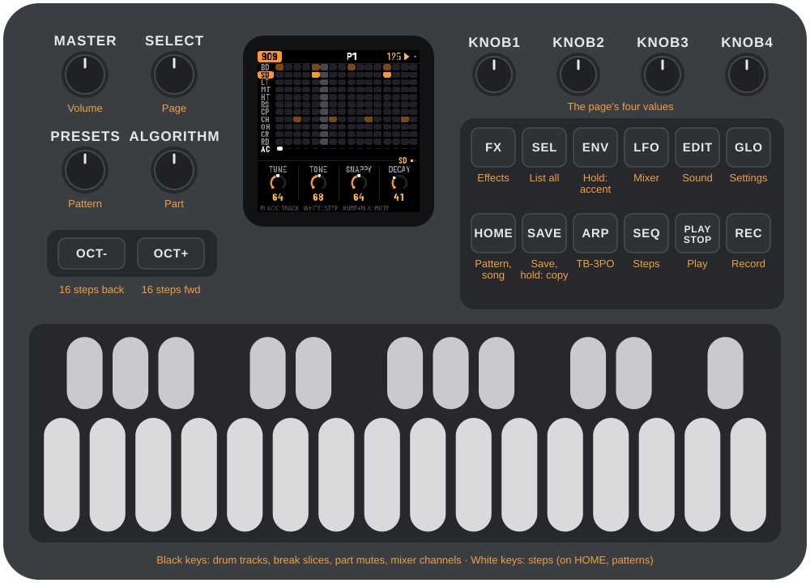

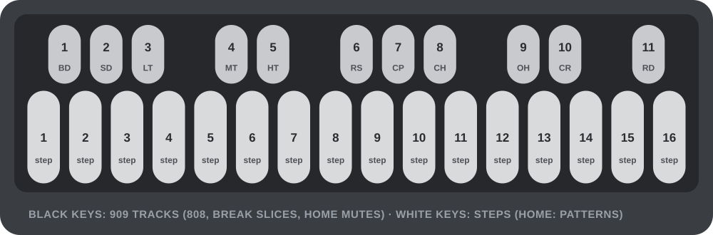

These controls do the same thing on every screen:

| Control | What it does |
|---|---|
| ALGORITHM | Chooses the part you're working on: 909, 808, 303A, 303B or BREAK. |
| PRESETS | Chooses the next pattern. On a part's screen it changes only that part; on HOME it changes all five. |
| SELECT | Moves to the next or previous page. In a list, it moves up and down. Hold HOME and turn SELECT to set the tempo. |
| KNOB 1–4 | Change the four values shown at the bottom of the screen. Turn slowly for single steps, quickly to sweep: a fast half turn covers the whole range. |
| SEL | Shows everything on the current screen as a list. In a list, it runs the highlighted action. When X0X asks a question, SEL means yes. |
| HOME | Goes to the HOME screen. In a list, it goes back. When X0X asks a question, HOME means no. |
| EDIT | Shows the part's own screen. Press it again for the next page. |
| ARP | Opens TB-3PO, the 303 line generator (on a 303 only). |
| FX | Opens the effects. |
| LFO | Opens the mixer and master. |
| GLO | Opens the settings. |
| SEQ | On a 303, switches the keys between steps and keyboard. On HOME, opens the song. |
| PLAY | Starts and stops. Hold HOME and press PLAY to redo. |
| REC | Turns recording on and off. Hold HOME and press REC to undo. |
| SAVE | Saves everything. |
| ENV, LFO | Hold one of these while pressing keys to add an accent (ENV) or a slide (LFO). |
| OCT-, OCT+ | Page through the steps, 16 at a time (1–16, 17–32, 33–48, 49–64). On HOME and SONG they show patterns 1–16 or 17–32. On the 303 keyboard they change the octave. In TB-3PO they mutate the line or write a new one. |
| White keys | Steps. On HOME, they choose patterns. |
| Black keys | Drum tracks, or the break's slices. On HOME, they mute parts. Hold HOME and press one on the 909 or 808 to mute just that track. |
| MASTER | Volume. |

(The SEL button is labelled SCL in Felucca.)

In a list, turn ALGORITHM to change the highlighted value. Rows with a return arrow are actions:
press SEL to run them. X0X always asks before doing anything that would lose notes.

**Help on the FM-1:** hold any button for a second on its own, and a card shows what it does on
the screen you're on, including its combinations (HOME's card, for example, covers tempo,
patterns, undo and redo). Let go and nothing happens. The card disappears as soon as you press
anything else, so button combinations work as normal.

**Undo:** hold HOME and press REC to take back your last change. The screen tells you what it
undid, for example UNDO 909 P1. Hold HOME and press PLAY to redo it. You can go back up to 32
steps (fewer after very big changes). A step is whatever you did before pausing for a moment:
a few steps tapped in a row, one turn of a knob, or a whole recording pass. Undo covers the
sounds, patterns, song and knob motion, even CLEAR PATTERN and FACTORY RESET. It doesn't cover
the tempo or the settings, and the history is cleared when you switch off.

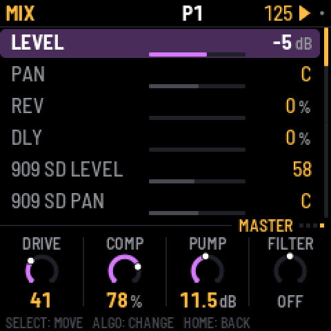
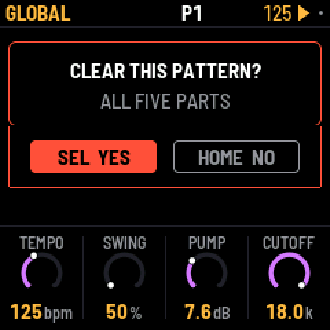

---

## 4. The screen

The **top line** shows, from left to right:

- the part, in its colour: 909 orange, 808 red, 303A green, 303B blue, BREAK violet;
- on the 909 and 808, whose sound the page sets: the selected track's name (BD) for the track's
  own pages, or ALL in amber (ALL SENDS, ALL PART, ALL KIT) for the pages that set the whole drum
  machine;
- small dots, one for each page, with the current page lit;
- the pattern playing, such as P3. If you've chosen a different pattern to play next, it
  appears after it: P3 >5 means pattern 5 is coming up. On a part longer than 16 steps, the 16
  steps the white keys show come after it (33-48);
- the tempo, which turns amber when X0X follows an external MIDI clock;
- a play symbol while playing, and a red dot while recording. A small grey dot means you
  have changes that aren't saved.

When you press a button that does something, the top line says what happened for about a
second, for example SAVED or COPIED TO P5.

The **bottom** of the screen shows the four knobs. Settings with only a few choices show a
row of small squares instead of a ring. When you turn a knob, its value is also shown in
large type for a second, with the track's name when it's a track's own setting (BD Tune).

A knob with a small **P** beside it belongs to the pattern: LENGTH, RATE, SWING, the 303's LINE
and TB-3PO settings, and the break's generator and loops. It changes when the pattern changes and
is copied with it. Every other knob is part of the sound, which stays the same whatever pattern
plays.

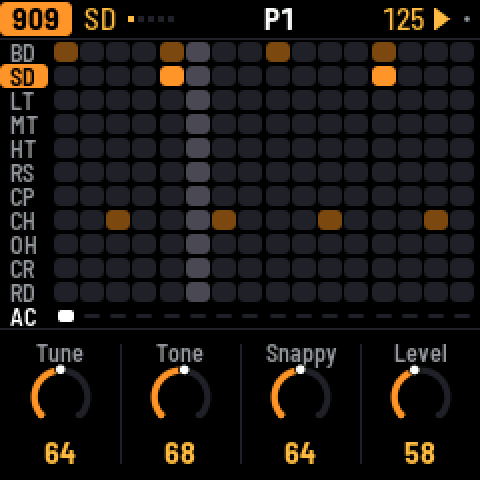
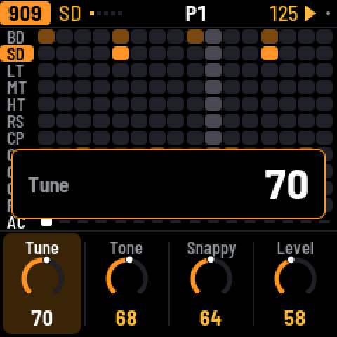

---

## 5. 909 and 808

Each drum machine has eleven tracks, one on each black key:

| Key | 909 | 808 |
|---|---|---|
| 1 | Bass drum (BD) | Bass drum (BD) |
| 2 | Snare (SD) | Snare (SD) |
| 3–5 | Low, mid and high tom | Low, mid and high tom, or congas |
| 6 | Rim shot (RS) | Rim shot, or claves |
| 7 | Clap (CP) | Clap, or maracas |
| 8 | Closed hat (CH) | Cowbell (CB) |
| 9 | Open hat (OH) | Cymbal (CY) |
| 10 | Crash (CR) | Open hat (OH) |
| 11 | Ride (RD) | Closed hat (CH) |

On the 808, the SOUND setting of a track switches it between tom and conga, rim and claves,
or clap and maracas. The 909's hats and cymbals are samples, as on the original machine.
Every other sound on both machines is synthesized.

Press a black key to pick its track. When the pattern is stopped you also hear it. While it
plays, picking a track is silent, so you don't add a hit to the groove (set GLO > KEY SOUND to
ALWAYS if you'd rather hear it every time). Then press white keys to turn the track on or off at
those steps. To place accents instead, hold ENV while you press white keys. An accent makes
every drum on that step louder.

A pattern can be up to 64 steps long. The white keys show 16 steps at a time: OCT+ moves to the
next 16 and OCT- back, and the top line shows which 16 you're on.

**Muting a track:** hold HOME and press a black key to mute that track, and again to bring it
back. A muted track's row turns grey. Track mutes aren't saved, and they stay as they are when
you mute or unmute the whole part on HOME.

The closed hat cuts off the open hat. On the 808 you can change this with CHOKE on the KIT
page.

Press EDIT to step through the selected track's sound settings (the top line shows the track's
name). The last one is the track's PAN, which places it left or right. (On the 808, the alternate sounds share their track's pan,
so the conga sits where the tom does.) After the track's own pages come these:

- SENDS: how much of the whole part goes to the reverb and the delay, its level, and its pan
  (the top line says ALL SENDS: these are for all eleven tracks together, on top of each
  track's own Rev and Dly).
- PART: LENGTH (1–64 steps), RATE (1/16, 1/16 triplet, 1/32 or 1/8 triplet), SWING and
  ACCENT.
- KIT: settings for the whole kit.

---

## 6. 303A and 303B

There are two identical 303s. Each has its own sound and its own line.

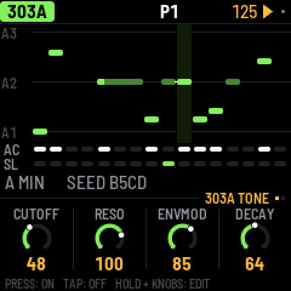

**Steps.** Press a white key to turn that step on; tap it again to turn it off. To edit a step,
hold its key and turn the knobs: KNOB 1 sets the note, KNOB 2 the gate (REST, NOTE or TIE),
KNOB 3 the accent and KNOB 4 the slide. An empty step turns on as soon as you press it, so you
can press and hold it and set its note in one go. A slide glides from this step's note into the
next one.

A **tie** holds the note before it through the step, so the note doesn't play again. On the
screen a tied note joins the note it holds in one long bar. Turning KNOB 1 on a tie makes it a
note of its own.

**Keyboard.** Press SEQ to turn all 27 keys into a keyboard; KEYS appears on the top line.
OCT- and OCT+ change the octave. If you play a key while still holding another, the 303
slides between them. Press SEQ again to go back to steps.

Press EDIT to step through these pages:

- FILTER: CUTOFF, RESO, ENVMOD and DECAY.
- VOICE: ACCENT, WAVE (saw or square), TUNE and VOLUME.
- DRIVE: DRIVE, DRIVE TYPE (off, soft or RAT), SLIDE time and ACCENT DECAY.
- SENDS: reverb, delay, level and pan.
- LINE: LENGTH (1–64 steps), RATE, DIRECTION (forward, reverse, ping-pong or random) and
  TRANSPOSE.

---

## 7. TB-3PO

TB-3PO writes 303 lines for you. Select a 303 and press ARP.

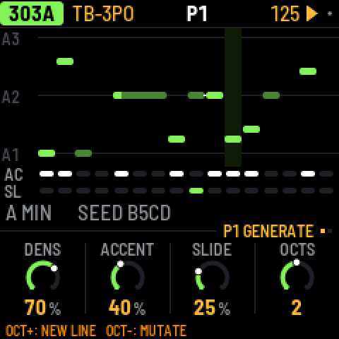

Press **OCT+** to write a completely new line. Press **OCT-** to mutate the current line,
which changes about a quarter of its steps.

TB-3PO has three pages:

- GENERATE: DENS, ACCENT and SLIDE set how many steps play, are accented and slide. OCTS sets
  the range, from 1 to 3 octaves.
- SCALE: ROOT, SCALE (minor, Phrygian, harmonic minor, minor pentatonic, Dorian or major),
  OCTAVE, and MUTATE, which mutates the line by itself every 1–16 bars (or never).
- LINE: the same as the 303's LINE page.

Turning the GENERATE and SCALE knobs doesn't change the line you're hearing. They set up the
next **OCT+** (new line) or **OCT-** (mutate), so your line stays exactly as it is, hand edits
included, until you press one of them. When the knobs no longer match the line, the screen shows
NEW LINE with a star. The same settings and seed always give the same line, the same one
Schwung's TB-3PO module would write.

---

## 8. Break

The break is a drum loop cut into eight slices, which X0X rearranges as it plays.

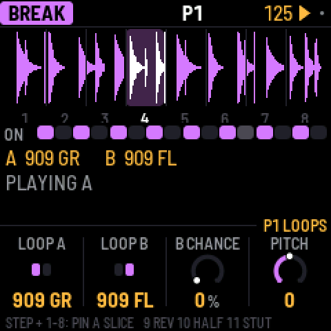

The white keys turn the break on or off for each of the bar's 16 steps. To play slices
yourself, hold black keys 1–8; when you let go, the generator takes over again. Hold key 9
to play backwards, key 10 to play at half speed, and key 11 to stutter.

**A step's own slice:** hold a white key and press black key 1–8. That step now always plays
that slice of loop A, from its start, whatever the generator would have chosen, and its box shows
the slice's number. Press the same black key again (holding the step) to give the step back to
the generator. This way you can fix the kick and snare where you want them and let the generator
play with the rest. A step's slice is saved with the pattern.

These settings control how the generator rearranges the loop:

- COMPLEXITY: how often it jumps to a different slice instead of playing the next one.
- ANCHOR: how strongly it keeps the kick and snare slices on beats 1 and 3.
- ROLL: how often it repeats a slice or moves to the slice next to it.
- FILL: how much the last bar of a phrase breaks these rules.
- RETRIG 2X, 3X, 4X and 8X: the chance, in each bar, of stuttering a beat.
- PHRASE: the length of a phrase, 2, 4, 8 or 16 bars, or off.
- B CHANCE: the chance of switching to loop B in the last bar of a phrase. With PHRASE off, the
  chance applies to every bar: at 50%, about half the bars play loop B.
- A LENGTH and B LENGTH: how often a new slice is chosen, from every 1/4 bar to every 8 bars.

These settings are saved with the pattern. The LOOPS page chooses loop A and loop B, and has
a PITCH setting. X0X comes with two loops of its own, 909 GR and 909 FL, played by its 909.
Loops you upload appear after them. Loops are stretched to fit the tempo.

### Your own breaks

X0X doesn't come with any recorded breaks, but you can load your own. The FM-1 has three
sample slots of about 7 seconds each. A one-bar loop takes about a third of a slot, so about
nine loops fit in total.

The easiest way is the **break loops page** on the X0X website
(charlesvestal.github.io/fm1-x0x/breaks), in Chrome or Edge. Connect the FM-1 with X0X running,
drop your audio files on the page (WAV, AIFF, MP3 and the other formats the browser can read),
and press Upload. The page shows which slot and name each loop will get and how full the slots
are, before anything is sent.

From the command line, with the FM-1 connected, run:

```
python3 tools/upload_breaks.py --bars amen.wav think.wav funky.wav ...
```

The `--bars` option takes one bar from each file; without it, each file is uploaded whole.
The loops are named BR1.1, BR1.2 and so on, up to BR2.1 and beyond, and they appear after
X0X's own loops. Uploading to a slot replaces whatever was in it.

To check what will fit without connecting the FM-1, add `--dry-run FOLDER`. If you have
schwung-breakbeat next to X0X, `--bbgen` uploads BB Gen's classic breaks.

To build loops into the firmware itself instead, see BUILDING.md.

---

## 9. Patterns

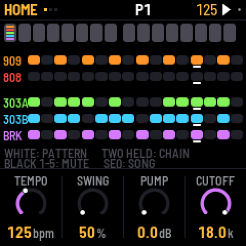

There are 32 patterns. Each part plays its own pattern, so the 303s can play pattern 3 while
the drums play pattern 7. A pattern holds each part's steps, length and rate, the break's
settings, the swing and any knob motion. Sounds, effects and master settings are not part of
a pattern and don't change when the pattern does.

On HOME, the white keys and the boxes are patterns 1–16; press OCT+ for patterns 17–32 (P17-32
shows under the boxes) and OCT- to go back. A box is lit when the pattern has notes, and it shows
a coloured bar for every part that is playing it: a bright bar if that part has notes in the
pattern, a dim one if the part is playing it empty.

To choose patterns:

- **One part:** go to that part's screen and turn PRESETS.
- **All five parts:** turn PRESETS on HOME, or press a white key on HOME.
- **A chain:** on HOME, hold two white keys at once. All five parts then play each pattern
  from the first to the second, one bar each, and start again. Choosing a single pattern ends
  the chain.

If the music is playing, the new pattern starts when the current bar ends. If it's stopped,
the new pattern takes over straight away.

When a part changes pattern, it starts again from step 1. The other parts carry on where they
were.

To manage patterns:

- **Copy:** hold SAVE and press a white key to copy to that pattern. On a part's screen this
  copies only that part. On HOME it copies all five parts as they're playing now. Holding SAVE
  for a moment shows a card that says exactly what will be copied (for example COPY 303A P1),
  and the top line confirms it afterwards (303A P1 COPIED TO P2). The white keys stand for the
  patterns HOME last showed, 1–16 or 17–32; while holding SAVE, OCT- and OCT+ switch between
  them.
- **Clear one part:** hold SAVE and press REC. To clear all five parts, use GLO > CLEAR
  PATTERN.
- **Mute a part:** on HOME, press black keys 1–5. Mutes aren't saved, except inside a song.

Parts can have different lengths, so they drift against each other. The 909's length sets
the length of a bar, and the 909's pattern sets the swing. Swing delays every second 16th
note: 50% is straight, and 75% is the most swing.

On HOME, the knobs are TEMPO, SWING, PUMP and CUTOFF.

---

## 10. Recording

Press REC to turn recording on, and press it again to turn it off.

- **Drums:** while the pattern plays, press black keys to record hits (with REC on, you always
  hear them). Hold ENV to record accented hits.
- **303, live:** switch the 303 to keyboard mode and play while the pattern runs.
- **303, one step at a time:** switch the 303 to keyboard mode and stop playback. Each key you
  press fills the next step, starting from step 1. Hold ENV while pressing a key for an
  accent, or LFO for a slide. To enter a rest, tap ENV on its own. To enter a tie, hold LFO
  and press OCT- or OCT+.

---

## 11. Knob motion

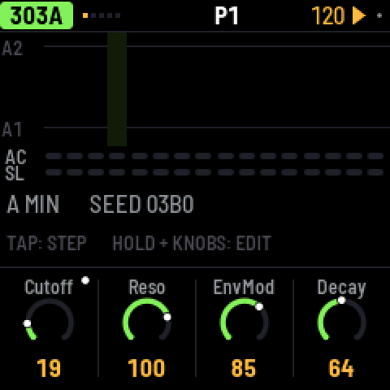

You can record knob moves into a pattern. Turn on REC, press PLAY, and turn any sound knob.
X0X records the knob on the steps where you moved it. Short pauses are filled in, so a slow
sweep has no gaps. On playback, the value glides smoothly from step to step rather than
jumping.

A knob with recorded motion has a dot in its corner, and its ring follows the recorded
value while it plays.

- On steps where you didn't move the knob, the knob's own setting plays.
- If you turn the knob while not recording, your turn takes over for one pass of the
  pattern, and then the recording plays again.
- **To clear a knob's motion,** hold SAVE and turn the knob.
- Motion belongs to a part's pattern: the 303's knobs record into the 303's pattern, and the
  effects and master record into the 909's. Copying or clearing a pattern copies or clears
  its motion too.
- When you stop, every knob goes back to its own setting.

There is room for 160 recorded knobs across all the patterns. When there's no room left, the
top line says MOTION FULL.

---

## 12. Song

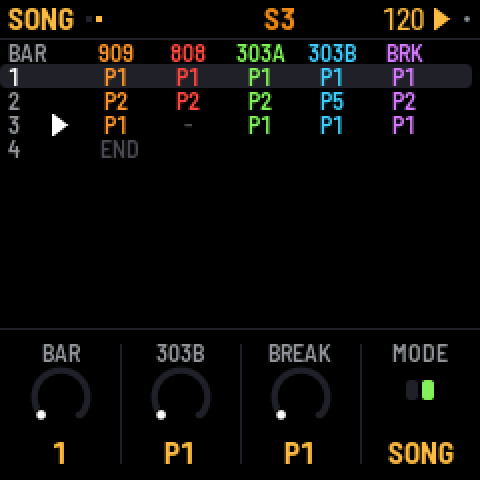

A song is a list of up to 192 bars. Each bar says which pattern each part plays and which
parts are muted. To open the song, press SEQ on HOME.

- **Write bars:** press a white key. The selected bar gets that pattern for all five parts,
  and the next bar is selected. Pressing keys at the end of the song adds new bars.
- **Edit a bar:** turn KNOB 1 to select the bar, then use the other knobs to set each part's
  pattern for that bar.
- **Mute parts in a bar:** press black keys 1–5.
- **Play the song:** set MODE to SONG, either on the second page of the SONG screen or in GLO,
  then press PLAY. The song starts at the selected bar and loops. While it plays, the top
  line shows S and the current bar number.
- **Record the song:** in SONG mode, turn on REC and press PLAY. As it plays, change patterns
  and mute parts however you like. Each bar is written into the song as it goes by, starting
  from the bar you started on, and the song grows if you play past its end. Recording
  replaces what was in those bars before.

Press SEL on the SONG screen for LENGTH, INSERT BAR, DELETE BAR and CLEAR SONG.

---

## 13. Effects

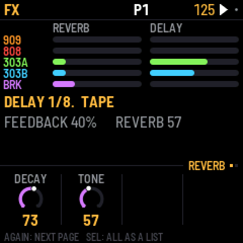

There is one reverb and one delay, and every part can send to both. Press FX: the first pages
set how much each part sends to the reverb and the delay. Each drum track also has its own
sends, on that track's own page. The reverb is stereo: whatever you send it comes back wide.

- REVERB: DECAY, TONE, HPF and LEVEL.
- DELAY: TIME, in note values from 1/32 to a dotted half note, plus FEEDBACK, TONE and LEVEL.
- TAPE: TYPE switches the delay between DIGI, a clean 12-bit digital delay, and TAPE, which
  wobbles, saturates, and can feed back on itself at high feedback. WEAR sets how worn the
  tape sounds. HPF cuts low end from the delay. PING makes the echoes bounce between left
  and right.
- KIT DRIVE: the 909's drive and glue compressor, applied to the whole mix.

---

## 14. Mix and master

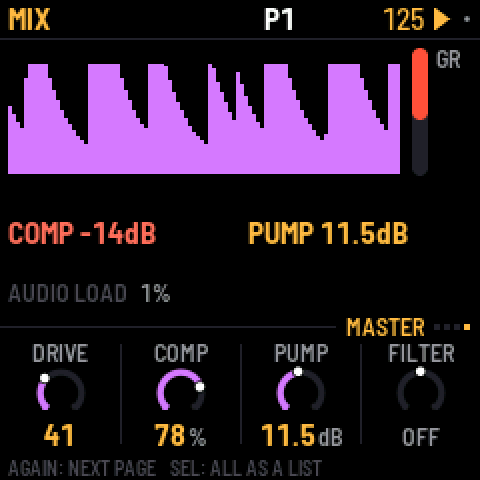

Press LFO to open MIX. It shows a level and a meter for each part, and the compressor's gain
reduction in red. The PANS page places the 909, 808 and both 303s left or right (C is the
middle); the break's pan is on its own SENDS page. As you turn a pan, the part stays at full
level on that side and fades out of the other.

The factory mix is set up for big beat: the break is up front with the 909 kick under it, the
303s run through RAT distortion into a tape delay, and the clap has reverb. The master
compressor squeezes hard, at 4:1 from -24 dB with 16 dB of makeup gain into the limiter, and
each 909 kick makes the whole mix pump by 4 dB. For a clean mix, set RATIO to 1:1 and PUMP
to 0.

| Compressor | Range |
|---|---|
| THRESH | -48 to 0 dB |
| RATIO | 1:1 (off) to 20:1, and INF |
| ATTACK | 0.1 to 100 ms |
| RELEASE | 10 to 1500 ms |
| MAKEUP | 0 to 24 dB |
| MIX | from dry to fully compressed, for parallel compression |

**PUMP** lowers the level of the whole mix each time the kick plays, by up to 24 dB, and lets
it swell back up over the compressor's release time. PUMP BY chooses which kick does this:
the 909's, the 808's, or both. Accented kicks pump harder. PUMP works even with the ratio at
1:1, and even when the kick is muted.

**FILTER** can be off, low pass, band pass or high pass, with CUTOFF and RESO. **LIMIT**
prevents clipping; leave it on.

---

## 15. Settings and saving

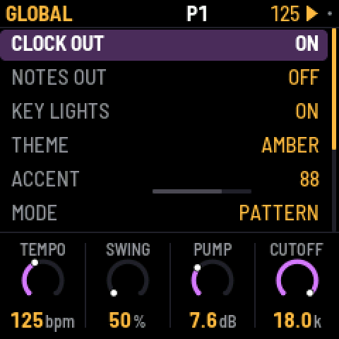

Press GLO for these settings:

| Setting | What it does |
|---|---|
| CLOCK OUT | Sends MIDI clock and start/stop messages. |
| NOTES OUT | Sends the patterns out as MIDI notes. |
| LIGHTS | ON: the key lights show the steps, and the unlit buttons glow dimly so they can be read. KEYS: the key lights only. OFF: neither. |
| KEY SOUND | STOPPED (the default): picking a drum or editing a 303 step is silent while the pattern plays, unless REC is on. ALWAYS: you always hear it. The 303 keyboard always plays either way. |
| THEME | The screen colour: green, amber, cyan, red or mono. |
| ACCENT | How loud an unaccented drum hit is compared with an accented one. |
| MODE | PATTERN, or SONG to play the song. |
| SAVE PROJECT | Saves everything. |
| AUTOSAVE | ON (the default): while the pattern is stopped, changes are saved by themselves once nothing has been touched for four seconds. OFF: only SAVE saves. |
| CLEAR PATTERN | Clears all five parts of the current pattern. |
| FACTORY RESET | Goes back to the factory sounds and empty patterns, with no song and no knob motion. Your saved project is kept until you save over it. |
| PERFORMANCE | Opens the performance page (below). |
| ABOUT X0X | Shows the version, how full the memory for patterns is (MEM), and the audio load. |

Press **SAVE** to save the sounds, all 32 patterns, the song, the knob motion, the tempo and
the settings. A small dot at the top right of the screen means you have unsaved changes.

X0X packs the patterns, the song and the knob motion to fit them in the FM-1's memory; empty
steps take almost no room, so a typical project uses a small part of it (GLO > ABOUT X0X shows
how much, as MEM). If a project ever grows too big to fit, X0X says MEMORY FULL: NOT SAVED and
keeps what was saved before; clearing patterns you don't need makes room. Projects saved by
earlier versions load as they were, with their steps on 1–32 and their patterns on 1–16.

With AUTOSAVE on (the default), you'll rarely need to. Whenever the pattern is stopped and you
haven't touched anything for four seconds, X0X saves your changes and says AUTOSAVED. It never
saves while the pattern plays, because writing to the FM-1's memory briefly cuts the sound.
Anything unsaved is lost when you switch off. With AUTOSAVE off, only SAVE saves.

### Performance

GLO > PERFORMANCE shows how hard the FM-1 is working, updated every second: the audio load and
its peak, any dropouts, and how much of the processor each part is using.

For a proper measurement, press SEL and choose RUN PERF TEST. X0X plays three patterns of its
own for about 15 seconds, from a simple loop up to everything as busy as it gets, then puts your
project back exactly as it was and shows the results. HOME or PLAY stops the test early.

X0X uses both of the FM-1's processor cores: the 808 and the break run on the second, so the 808's share on the
performance page is the time the first core waits for them, and the whole load is lower: on
one FM-1 the test's three patterns went from 43%, 83% and 115% on one core to 39%, 54% and 68%,
and the busiest moment of the worst case from over the limit to 84%.

When the FM-1 gets close to its limit, X0X lightens the load by itself instead of dropping out:
the 303s stop oversampling (bright, resonant notes get a touch grittier) and the 808's sounds end
a little sooner as they fade. While this is happening, GUARD lights up in amber next to the audio
load; it switches off again after three quiet seconds. The performance page counts how often it
has kicked in (GUARD 3x).

If X0X drops out on one of your patterns, a photo of the test results and of the pattern is the
most useful thing you can send.

KNOB 1 turns on some extra counters (STALLS). They're experimental: if the FM-1 acts up with them
on, switch it off and on again.

---

## 16. MIDI and USB audio

When connected over USB, the FM-1 shows up as a MIDI device called "X0X FM-1".

X0X takes MIDI from USB and from the FM-1's TRS MIDI IN jack, both the same way:

| Input | What it plays |
|---|---|
| Channel 10 | The 909, with General MIDI drum notes: 36 kick, 38 snare, 41, 45 and 50 toms, 37 rim, 39 clap, 42 closed hat, 46 open hat, 49 crash, 51 ride. |
| Channel 11 | The 808, with the same notes, plus 56 for the cowbell and 49 for the cymbal. |
| Channel 2 | 303A. Overlapping notes slide, and a velocity of 100 or more plays an accent. |
| Channel 3 | 303B, in the same way. |
| Channel 4 | Notes 36–43 play break slices 1–8. |
| Clock | X0X follows an incoming MIDI clock automatically, and returns to its own tempo half a second after the clock stops. Start, Stop and Continue start and stop the patterns. |

X0X can also send MIDI: clock and start/stop when CLOCK OUT is on, and the patterns as notes
on the channels above when NOTES OUT is on.

### USB audio

Over the same USB cable, the FM-1 also shows up on a computer as an audio input called
"X0X FM-1": two channels at 44.1 kHz, with no driver to install. It carries what the headphones
hear, after VOLUME, in stereo.

Record it in any audio app, or monitor it live through one. The FM-1 keeps its USB audio in step
with the computer's clock, so live monitoring doesn't drift or drop out. The first moment after an
app opens the input can click while the FM-1 settles.

---

## 17. Troubleshooting

**Update mode:** hold OCT- and OCT+ together for five seconds. A countdown appears; let go
before it ends to cancel.

**Calibration:** if a button or knob does the wrong thing, hold OCT- and OCT+ while you switch
the FM-1 on. The screen then asks you to press each button and turn each knob in turn.

**After a crash:** X0X shows a red CRASH screen and restarts by itself a few seconds later. The
next start shows RESTARTED AFTER A CRASH and an address (PC ...) for a moment. If you report the
problem, include that address and what you were doing.

**Safe mode:** if X0X crashes twice in a row while starting, it starts in SAFE MODE instead. There's
no sound, but USB works, so the web installer can reach it: reinstall X0X, or put the stock
firmware back from the same page. Press PLAY to try starting X0X normally again. If even safe
mode fails twice, the FM-1 drops into the chip's own update mode, and only the rescue below can
reach it.

**Stuck on the start screen after changing BRIGHTNESS:** versions up to 0.9-beta had a brightness
setting that could freeze the FM-1, and because the setting was saved, it stayed frozen at every
start, even after reinstalling. Install 0.10-beta or later from the web installer: the setting is
gone, the saved value is ignored, and the FM-1 starts normally.

### Recovering an FM-1 that won't start

Since 0.5-beta, an FM-1 that keeps crashing starts in safe mode (above), where the web installer
can fix it. Older versions instead dropped into the chip's own update mode after two crashes (0.2-
beta did this: the X0X screen, a red X0X CRASH screen, then a blank screen). Neither the web
installer nor M-VAVE's updater can see an FM-1 in that state, but a script can put M-VAVE's
firmware back, on a Mac, with the USB cable you already have:

Open Terminal, paste this line and press Return:

```
bash -c "$(curl -fsSL https://raw.githubusercontent.com/charlesvestal/fm1-x0x/main/tools/fm1_rescue.sh)"
```

1. If a window asks to install the command line developer tools, click Install. When it has
   finished, paste the line again.
2. If it asks for a password, type your Mac password (nothing shows as you type) and press Return.
3. When it says it's waiting, plug the FM-1 in and switch it on. It crashes and goes blank, and
   the script catches it. It checks the chip, saves a backup of the FM-1's memory in the
   `fm1-rescue` folder in your home folder, and asks before it writes anything.
4. Type **yes** and press Return. Don't unplug anything until it says it's restarting the FM-1.
   The FM-1 then starts into its original firmware, and you can install X0X again from there.

The script downloads M-VAVE's FM-1 V15 firmware and JieLi's flash loader, and checks both against
known fingerprints. It writes only the firmware area of the memory, never the bootloader or the
FM-1's own settings, and checks everything it writes. Running it again is always safe. If it fails,
copy everything in the Terminal window and
[open an issue](https://github.com/charlesvestal/fm1-x0x/issues). If the FM-1 never shows up at
all, Felucca's [FM-1-transporter](https://github.com/kurogedelic/FM-1-transporter) (a small
RP2040 board wired to the USB lines) can still reach it.

---

## 18. Parameters

Drum settings range from 0 to 127. DIST, the distortion type, can be DIODE, CLIP, SAT, BFZ,
PDIST, FOLD or CRUSH. PAN goes from L64 through C (the middle) to R63.

| 909 track | Settings |
|---|---|
| BD | Tune, Attack, Decay, Level, Pitch depth, Pitch, Drive, Dist, Pan |
| SD | Tune, Tone, Snappy, Decay, Level, Drive, Dist, Rev, Dly, Pan |
| LT, MT, HT | Tune, Decay, Level, Attack, Drive, Dist, Rev, Dly, Pan |
| RS | Level, Tune, Drive, Dist, Rev, Dly, Pan |
| CP | Level, Tune, Tail, Drive, Dist, Rev, Dly, Pan |
| CH, OH | Decay, Level, Tune, Drive, Dist, Rev, Dly, Pan |
| CR, RD | Tune, Level, Decay, Drive, Dist, Rev, Dly, Pan |
| KIT | Accent, Velocity |

| 808 track | Settings |
|---|---|
| BD | Level, Tone, Decay, Tune, Attack, Drive, Dist, Pan |
| SD | Level, Tone, Snappy, Tune, Decay, Drive, Dist, Rev, Dly, Pan |
| LT, MT, HT | Level, Tune, Decay, Sound, Drive, Dist, Rev, Dly, Pan |
| RS | Level, Tune, Decay, Sound, Drive, Dist, Rev, Dly, Pan |
| CP | Level, Tune, Decay, Attack, Sound, Drive, Dist, Rev, Dly, Pan |
| CB, CH | Level, Tune, Decay, Drive, Dist, Rev, Dly, Pan |
| CY, OH | Level, Decay, Tune, Drive, Dist, Rev, Dly, Pan |
| KIT | Level, Accent, Choke (off, closed cuts open, or both) |

| 303 setting | Range |
|---|---|
| Cutoff, Reso, EnvMod | 0–127 |
| Decay | 200–2000 ms |
| Accent | 0–127 |
| Wave | Saw or square |
| Tune | A from 400 to 480 Hz; the middle is 440 Hz |
| Volume | 0–127 |
| Drive, Drive type | Off, soft or RAT |
| Slide | 2–360 ms |
| Accent decay | 30–3000 ms |

| Break setting | Range |
|---|---|
| Complexity, Anchor, Roll, Fill | 0–100 |
| Retrig 2x, 3x, 4x, 8x | 0–100 |
| Phrase | Off, 2, 4, 8 or 16 bars |
| B chance | 0–100 |
| A length, B length | 1/4, 1/2, 1, 2, 4 or 8 bars |
| Level | 0–127 |
| Pitch | -12 to +12 semitones |

| Effect page | Settings |
|---|---|
| REVERB | Decay, Tone, HPF, Level |
| DELAY | Time (1/32, 1/16T, 1/16, 1/8T, 1/16., 1/8, 1/4T, 1/8., 1/4, 1/2T, 1/4., 1/2, 1/2.), Feedback, Tone, Level |
| TAPE | Type (DIGI or TAPE), Wear, HPF, Ping (off or on) |
| KIT DRIVE | Volume, Dist, Drive, Comp |

The delay follows the tempo, including an external MIDI clock. A delay longer than two seconds
(1/2. below 90 BPM, 1/2 below 60) plays at half that length, which still lands on the beat. With
PING on, the echoes bounce from left to right, one delay time apart; delays longer than one
second play in the middle instead.

---

## 19. Credits

X0X is free software under the GNU General Public License, version 3. If you share the
firmware, you must also share its source code.

- The platform (hardware layer, USB, update loader, installer and storage) is from
  **Felucca** by Leo Kuroshita, Hügelton Instruments.
- The 909 is from **9W9** by athousanddetails, which is based on **ER-99** by Matthew
  Cieplak. Its hat and cymbal samples are ER-99's.
- The 808 is from **8W8** by athousanddetails.
- The 303 is from **schwung-303**, built on Open303 by Robin Schmidt (MIT licence), with
  extensions based on jc303 and dm-Rat.
- TB-3PO is from **schwung-tb3po**, which comes from the Phazerville Hemisphere Suite.
- The break generator is from **BB Gen** by mestela, used with permission.
- The fonts are Barlow Semi Condensed and Terminus (SIL Open Font License).

M-VAVE and FM-1 are trademarks of their owners, and TR-808, TR-909 and TB-303 are Roland
trademarks. X0X is not connected with M-VAVE, Roland or Hügelton Instruments.
