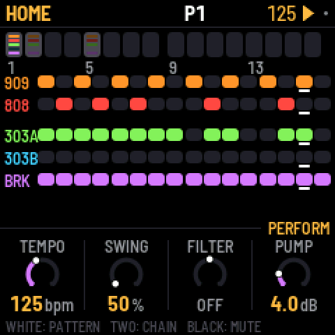
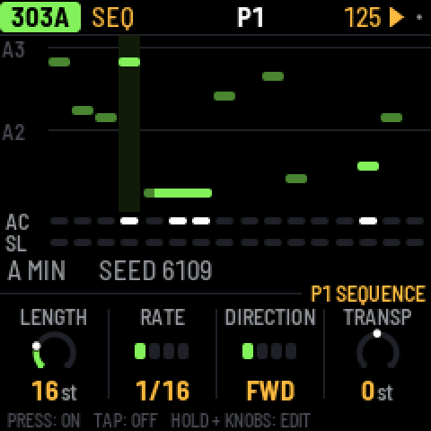
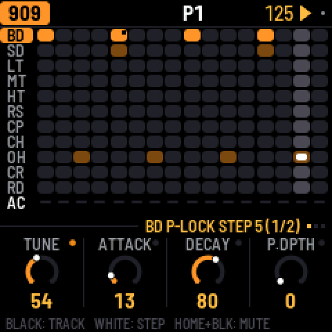
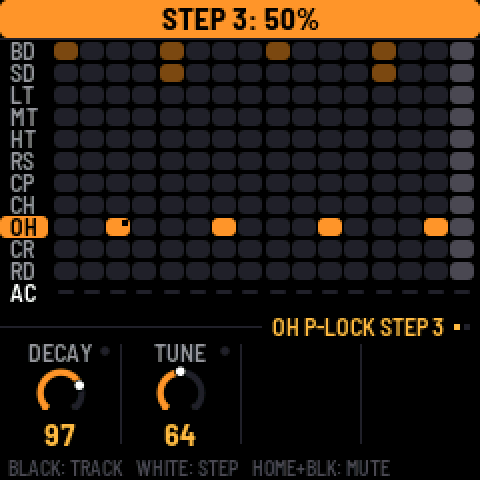
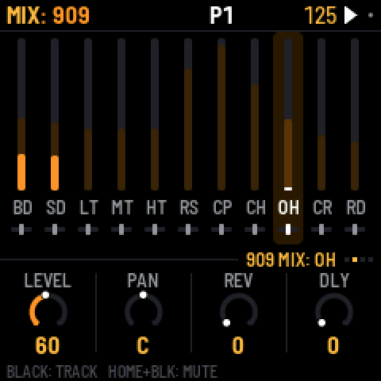
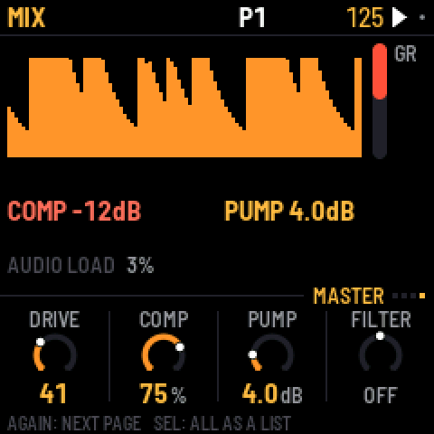
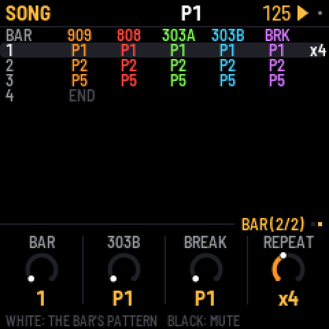

# What's new

The newest version first. Install it with the [web installer](../install/); the
[manual](../manual/) covers everything in detail.

## 1.0 · 10 October 2026

### Highlights
- Uses both of the FM-1's processor cores: no dropouts, even on the most complex patterns. The busiest test pattern went from about 115% to 68% load. Thanks @keremcode
- Simpler navigation: HOME for the pattern and song, SEQ for the selected part's steps, EDIT for its sound. Press a button again, or turn SELECT, for the next page.
- Clearer screens: each knob row says whose knobs they are, a hint line shows what the keys do, holding any button explains it, and labels are clearer throughout.
- Up to 64 steps per part and 32 patterns
- Per-step p-locks (on EDIT, hold a step and turn a knob) and probability (hold a step and turn SELECT)
- A drum mixer with per-track mutes, sends and hit meters
- A new [break tool](../breaks/): load and manage your own loops from the browser (BR1, BR2…)

### Sequencing
- New 303 note entry: REC turns the keys into a keyboard, ties show as one long note, and holding a step + OCT moves it an octave
- Copy and paste whole patterns: hold SAVE, then press a white key
- Song bars can repeat, ×1 to ×8
- A break step can have its own slice: hold the step and press black keys 1–8
- The break's COMPLEXITY now eases ROLL and FILL in gently

### Sound and mix
- Reverb and delay sends on both kicks
- DECAY on the 909 snare
- One-knob COMP and FILTER on the master, and the MASTER page shows the output level
- A calmer factory reverb
- OUTPUT LOUD, for quiet headphones
- The 808's hats always choke like the 909's (CHOKE setting removed)

### MIDI
- A MIDI channel per part, in and out, or OFF
- A steady tempo readout when following an external clock

### Feel and fixes
- Knobs: no more missed or doubled clicks, and small turns are exact
- Key lights in two brightness levels: bright for chosen, dim for available
- Saving waits until you stop, so the audio never cuts out
- B CHANCE works without PHRASE
- CLEAR PATTERN no longer leaves a bar showing on HOME
- The keys no longer trigger steps or slices on the MASTER and FX screens

Projects saved with 0.10 load as they were.

## Earlier versions

0.10.3-beta · 8 October 2026

- **PLAY is green**: PLAY uses its green light, and turns red only while recording (REC on). Its glow is green too.

0.10.2-beta · 8 October 2026

- **Readable buttons in the dark**: the buttons that aren't lit now glow dimly, so their labels can be read on the black FM-1. The KEY LIGHTS setting is now LIGHTS: ON (the default, and what a saved "on" becomes) shows the key lights and the glow, KEYS shows the key lights only, OFF neither.
- The performance page also reports how deep the interrupts' stack has gone.

0.10.1-beta · 6 October 2026

- No more zippering when you turn volume, pan or the sends quickly: part volume, pan and sends, the master volume and every drum voice's pan now glide over about 10 ms instead of jumping.

0.10-beta · 6 October 2026

- **Fixes the brightness freeze**: setting BRIGHTNESS low could freeze the FM-1, and it then stayed stuck at the boot screen (dim, no input) even after reinstalling. The setting is gone, a saved value is ignored, and the screen is always at full brightness. If your FM-1 is stuck, install 0.10-beta from the web installer.
- **Stereo**: every part has a PAN (its SENDS page, or MIX > PANS), and so does every 909 voice and 808 track (the last setting on its page). With everything centred it sounds exactly as before.
- **Stereo reverb**, and a **ping-pong delay** (PING on the FX TAPE page; delay times over one second stay centred).
- **TRS MIDI IN**: notes, clock and transport from the TRS jack, the same as over USB.

0.9-beta · 5 October 2026

- **USB audio**: the FM-1 shows up on a computer as a 44.1 kHz audio input ("X0X FM-1"), no driver. It is resampled to the computer's USB clock, so live monitoring (an AU host, a DAW) doesn't drift or drop out.
- **USB MIDI clock and transport fixed**: clock, Start, Stop and Continue sent over USB were ignored; X0X now follows a DAW's clock and transport.
- **Fewer dropouts on busy patterns**: audio renders in 11.6 ms blocks, so a heavy step no longer overruns (adds 5.8 ms of latency).
- **808**: voices stop once their tail is 60 dB under the hit, saving CPU without changing what you hear.
- **303**: holding a step no longer toggles it (only a tap does); holding or editing a step follows KEY SOUND like the drum keys, so it's silent while the pattern plays.
- **TB-3PO**: the GENERATE and SCALE knobs no longer rewrite the line; they set up the next **OCT+** (new line) or **OCT-** (mutate). The screen marks changed settings with a star.

0.8-beta · 5 October 2026

- Fast knob turns count: a quick flick no longer gets lost (the encoder decoder keeps up with skipped states)
- Overload guard: when the FM-1 nears its CPU limit, the 303s drop oversampling and the 808's tails end sooner instead of dropping out; GUARD shows next to the audio load, and the performance page counts how often it engaged
- Less screen tearing: the display runs at 60 MHz, the main area sends only what changed, and both halves change together. Some tearing remains: the FM-1 has no tearing-sync line

0.7-beta · 5 October 2026

- Knob acceleration by speed: turn slowly for single steps, quickly to sweep (a fast half turn covers the whole range).
- GLO > BRIGHTNESS: the screen's brightness, 1 to 8.
- tools/upload_breaks.py: no longer crashes when given more loops than fit; retries a write the USB link lost.

0.6-beta · 5 October 2026

- Knobs and LEDs under load: the key/knob/LED matrix scan now keeps its rhythm while the audio renders. Fast knob turns no longer lose their steps, and the LEDs no longer flicker with the audio load. (Found on the first hardware run.)

0.5-beta · 5 October 2026

- Undo and redo: HOME + REC / HOME + PLAY, up to 32 steps, for sounds, patterns, the song and knob motion (CLEAR PATTERN and FACTORY RESET included). The screen says what was undone.
- AUTOSAVE (GLO, on by default): while stopped, changes save themselves after 4 s of quiet. Saves now write only what changed.
- Help cards: hold any button for a second to see what it does on the current screen, with its combinations.
- Safe mode: after two failed starts X0X starts with no sound and USB on, so the web installer can always reach it (it used to drop into the chip's update mode, which no installer can see). PLAY tries again.
- After a crash, the next start says so and shows where.
- The web installer can put M-VAVE's stock firmware (FM-1 V15) back.
- The browser version can load your own breaks.

0.4-beta · 4 October 2026

- Black drum keys select silently while the pattern plays (new GLO > KEY SOUND, default STOPPED); they still sound when stopped and with REC on. ALWAYS keeps the old behaviour.
- The 303 lines start empty, like the drums: a fresh FM-1 (or FACTORY RESET) no longer plays two generated lines. OCT+ on TB-3PO writes one. Saved projects are unchanged.
- Delay: a division longer than the 2 s line (1/2. below 90 BPM, 1/2 below 60) now halves and stays on the beat instead of being cut off the grid.
- GLO > ABOUT shows the real version (every release said 0.1).
- New: X0X in the browser, https://charlesvestal.github.io/fm1-x0x/emu/
- New: recovering an FM-1 that won't start, from a Mac (manual, Troubleshooting).

0.3-beta · 4 October 2026

- Fixes the crash on hardware ("X0X CRASH" screen soon after start): a divide-by-zero trap fired in the master limiter. The trap is off and the divide is clamped.
- Includes the PERFORMANCE screen and PERF TEST (GLO menu) from 0.2-beta.

0.2-beta · 4 October 2026

**Still not run on a real FM-1.** This build measures itself, so the first install tells us what the FM-1 can do. Installing is at your own risk; M-VAVE's updater (M-UPGRADE) puts the official firmware back.

**Please run the performance test:** GLO > PERFORMANCE, then SEL > RUN PERF TEST. It plays three built-in patterns for about 15 seconds, puts your project back as it was, and shows a table. A photo of that screen is the most useful thing you can send.

- **Install:** https://charlesvestal.github.io/fm1-x0x/install/
- **Manual:** https://charlesvestal.github.io/fm1-x0x/manual/

Changes since 0.1-beta:
- PERFORMANCE page: clock, audio load and peak, dropouts, each part's share of the CPU; RUN PERF TEST
- Big-beat factory mix (break up front, 909 kick under it, RAT 303s into tape delay, a pumping master)
- No clicks on the kick: the 909 kick's attack back to 9W9's, the pump eases in, a look-ahead limiter
- Cheaper engines: silent parts skipped, lighter master, faster tanh, a RAT clipper without square roots or divides
- The manual rewritten in plain sentences, with a Getting started tour

0.1-beta · 4 October 2026

First public build. **Not yet run on a real FM-1**: the first people to install it are the first test. Installing is at your own risk; M-VAVE's updater (M-UPGRADE) puts the official firmware back.

- **Install:** https://charlesvestal.github.io/fm1-x0x/install/ (Chrome or Edge, the FM-1 on USB), or `python3 tools/fm1_install.py x0x-0.1-beta.fwsc` with the file below.
- **Manual:** https://charlesvestal.github.io/fm1-x0x/manual/

What's in it:
- A 909 (from 9W9 / ER-99) and an 808 (from 8W8), eleven tracks each
- Two 303s (from schwung-303 / Open303), each with a TB-3PO line generator
- A breakbeat generator (from BB Gen); load your own breaks with `tools/upload_breaks.py`
- 16 patterns, each part on its own pattern; a song mode; recorded knob moves
- Reverb and tape delay sends on every part; a master compressor with kick-keyed pump, a filter and a limiter
- A big-beat factory mix

